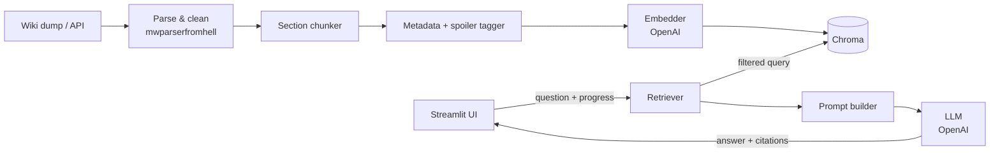

# YoRHa Archive: Spoiler-Aware NieR:Automata Lore Assistant

**Status:** Draft v0.6 (OpenAI only, `gpt-4o-mini` for chat; fixed dump snapshot as the corpus) · **Owner:** Christopher Chen · **Last updated:** 2026-09-26

## 1. Overview

YoRHa Archive is a local question-answering app for NieR:Automata lore. It uses retrieval-augmented generation (RAG) over the NieR Fandom wiki. Users ask questions in plain language and get answers with citations to specific wiki sections.

The key feature is **spoiler awareness**: the user sets how far they've played, and the app never retrieves or reveals content beyond that point.

The app uses **OpenAI** for both generation and embeddings. Model names are set in the config file (§12.1), so switching models doesn't require code changes. Chroma runs locally for vector storage.

## 2. Goals and non-goals

### Goals (MVP)

- Ingest the NieR:Automata portion of the NieR wiki and turn it into clean, section-level chunks with metadata.
- Answer lore questions with inline citations that link back to the source wiki section.
- Filter retrieval by the user's story progress, so content past their progress point is never retrieved.
- Say "I don't know" instead of guessing when the retrieved context doesn't answer the question.
- Ship a repeatable evaluation that measures retrieval quality and spoiler leaks.
- Access OpenAI through small provider interfaces (§8.1), so other providers can be added later without touching the pipeline.

### Non-goals (MVP)

- Other games in the series (Replicant, Drakengard, the novellas and stage plays). These are on the roadmap in §13.
- Hosting the app for multiple users or deploying it publicly.
- Gameplay guides: builds, trophy guides, walkthroughs.
- Live sync with wiki edits. MVP uses a one-time snapshot.

## 3. Users and example questions

**Primary user:** a player partway through the game who wants lore context without spoilers. **Secondary user:** a player who has finished the game and wants deep lore lookups.

| Question | Progress setting | Expected behavior |
|---|---|---|
| "Who is Pascal?" | Route A | Answers with Route A information only |
| "What is the Council of Humanity?" | Route A | Gives a partial answer and says more is revealed later |
| "What is Project YoRHa?" | Route C+ | Full answer with citations |
| "What happens in Ending E?" | Route B | Declines: "That's covered later in the story." |
| "What's the best chip setup?" | any | Out of scope; declines politely |

## 4. Architecture



The embedder and the LLM are both accessed through provider interfaces (§8.1). The rest of the pipeline doesn't depend on the OpenAI SDK directly.

There are two pipelines:

- **Offline ingest** (`scripts/ingest.py`) runs once per wiki snapshot.
- **Online query** runs in the Streamlit app for each question.

## 5. Data source and ingestion

### 5.1 Source

- **Wiki:** `nier.fandom.com`, the pages relevant to NieR:Automata.
- **Method:** the Fandom XML dump of current revisions, `s3.amazonaws.com/wikia_xml_dumps/n/ni/nier_pages_current.xml.7z` (2.8 MB compressed; newest revision 2026-01-28). This snapshot is the whole corpus. Wiki edits made after it are deliberately ignored, and the MVP doesn't call the MediaWiki API.
- **License:** the content is CC BY-SA. Every answer must cite and link to its sources, and the README must credit the wiki.

### 5.2 Page selection

Include pages that meet any of these conditions:

- The page is in an Automata-related category (characters, locations, machines, weapons, story, endings, side quests, and so on). These are the `NieR:Automata ...` categories and all their subcategories, found by walking the category tree.
- The page is within 1 link of the main `NieR:Automata` page.
- The page's infobox names NieR:Automata in a game field (`first_appearance`, `other_appearanceN`, `appears`, `game`). This catches pages whose categories are added by templates, which the dump doesn't show.
- The page is a subpage of a selected page (e.g. `X/Character Story`), other than `/Gallery`.
- The page is on a short hand-picked list of core concept pages (`selection.include_titles`, e.g. `Machine`, `Android`, `Logic Virus`) that the rules above miss.

Excluded, per §2: gameplay-guide categories (Achievements, Plug-in Chips, Fishing Encyclopedia), non-game media (Ver1.1a, novels, picture books, stage plays), other games' hub pages, and soundtrack tracklists. The lists are in `config.yaml` under `selection`.

Record the selected page list in `data/manifest.json`, with the reason each page was included. It can be hand-edited to add or remove pages; `scripts/ingest.py` reuses it unless run with `--rebuild-manifest`.

### 5.3 Parsing and cleaning

Use `mwparserfromhell` to process the wikitext:

- **Remove:** navboxes, galleries, reference tags, edit links, image captions, and maintenance templates.
- **Extract as structured metadata:** infobox fields such as `type`, `affiliation`, and `voiced by`.
- **Convert to plain text:** internal links, keeping the link text. Also record the link targets on the chunk as `links_to` for later graph features.
- **Keep:** section headings. They're needed to build each chunk's `section_path`.

## 6. Chunking and metadata

### 6.1 Chunking strategy

- Chunk by **wiki section**. If a section is longer than about 400 tokens, split it on paragraph boundaries, with about 50 tokens of overlap between pieces.
- Merge sections shorter than 50 tokens into their parent section (or, when the parent has no text of its own, into the previous sibling). **Exception:** route/ending/chapter sections, tabbed sections (tabs usually split content by route or ending), and Trivia/Theory sections are never merged, so the spoiler tagger (§7.2) still sees their headings and the speculation flag is kept.
- Start each chunk's embedded text with a context header, for example: `2B > Story > Route B`. The header uses a short display name from `chunking.display_names` when one is set (`YoRHa No.2 Type B` → `2B`). Redirect aliases aren't used, because some are spoilers (2B's redirect `2E`).
- Add an allow-listed set of infobox fields (role, race, voice actors, and so on; `chunking.infobox_text_fields`) as text to each page's first chunk, so facts like "who voices 2B" can be retrieved. Fields like `aka` and `status` are left out because they can carry late-game spoilers.
- Count tokens with `tiktoken` (`cl100k_base`, the tokenizer of `text-embedding-3-*`).

### 6.2 Chunk schema

| Field | Type | Notes |
|---|---|---|
| `chunk_id` | str | `{page_id}:{section_idx}:{part}` |
| `page_title` | str | |
| `section_path` | str | e.g. `9S > Story > Route C` |
| `url` | str | Page URL plus section anchor |
| `text` | str | Cleaned text, including the context header |
| `categories` | list[str] | Wiki categories |
| `content_type` | enum | `character`, `story`, `location`, `machine`, `weapon_story`, `item`, `quest`, `trivia`, `speculation`, `meta` |
| `spoiler_level` | int | See §7 |
| `spoiler_source` | enum | `heading_rule`, `category_rule`, `llm`, `manual`, `default` |
| `is_speculation` | bool | True for sections like "Theories" and "Trivia" |
| `infobox` | dict | Only on a page's first chunk |
| `revision_id` | int | Wiki revision the chunk came from |

## 7. Spoiler model

### 7.1 Progress levels

| Level | Label | Unlocks |
|---|---|---|
| 0 | Prologue | Opening mission, basic premise |
| 1 | Route A | Playthrough 1 (2B), Ending A |
| 2 | Route B | Playthrough 2 (9S), Ending B |
| 3 | Route C/D | Playthrough 3 and Endings C/D |
| 4 | Ending E | Ending E |
| 5 | Everything | DLC, and lore revealed outside the game (anime, stage plays, novels, other games) |

In-game side content (side quests, weapon stories, archives, item and enemy descriptions) is tagged by when it becomes available in play, not level 5. Otherwise players below level 5 would lose most quest and item lore that's available from Route A.

### 7.2 Tagging pipeline

Tag each chunk with a spoiler level. Rules run in order, and the first rule that matches wins:

1. **Manual override:** `data/spoiler_overrides.yaml`, keyed by `chunk_id` or page title.
2. **Heading rule:** the section path contains a route or ending marker, like "Route B" or "Ending E". Use the matching level.
3. **Category rule:** the page is in a category that implies a level. For example, late-game characters are tagged as level 3 or higher.
4. **LLM classifier:** `gpt-4o-mini` reads the chunk plus the level definitions and outputs `{level, confidence}`. Accept the result if confidence is 0.7 or higher. The classifier has its own config section (§12.1) for settings like temperature, but uses the same model.
5. **Default:** tag the chunk **level 5**. When unsure, hide the content.

Write a report of all tags from steps 4 and 5 to `reports/spoiler_tags.csv` for manual review.

Implementation notes (M4, 2026-09-25):

- **Heading rule** also covers an `Endings > C` tab, ending page titles (`The (E)nd of YoRHa`), and config patterns in `spoilers.heading_rules`: crossovers (`Other Appearances`), Ver1.1a, concerts and stage plays, the DLC, and other games' sections → 5; the prologue chapter → 0.
- **Category rule** includes the wiki's own `{{Spoiler|NA|Route=…}}` banners, applied to the section that contains the banner and its subsections, not the whole page. Banners for other games or with no route are ignored.
- **LLM classifier:** the prompt (`PROMPT_VERSION` in `src/spoilers.py`) anchors major reveals to the levels given by the wiki's banners: humanity's extinction and the Council fabrication are Route B at the earliest, and black boxes, 2E, and YoRHa's disposal are Route C/D. Results are cached in `data/spoiler_llm_cache.jsonl`, so reruns only pay for changed chunks. Self-reported confidence is almost always 0.8–1.0, so the 0.7 threshold rarely triggers. Accuracy comes from the prompt, the rules, and the audit below.
- **Audit:** `scripts/audit_spoilers.py` flags chunks that state a major twist but are tagged below the level that reveals it. Fixes go in `data/spoiler_overrides.yaml` (keyed by section path where possible). Since M6 it also flags Route C chapter numbers (11–17) and Tower-entry terms (Resource Recovery Units, Access Keys), which the classifier often tagged by an item's first availability rather than by what the text reveals.
- **Applying overrides:** `scripts/ingest.py --retag` re-tags `data/chunks.jsonl` and rewrites the metadata of every existing index in place, without re-embedding. `--reindex` rebuilds only the configured embedder's index, so it would leave other indexes with stale tags.
- **Lead chunks:** a page's lead section path equals its title, and a title key overrides the whole page, so lead chunks are overridden by `chunk_id`.

### 7.3 Enforcement

Spoiler protection happens at two layers:

1. **Retrieval, the hard guarantee:** every Chroma query includes the filter `where={"spoiler_level": {"$lte": user_level}}`. Content above the user's level never reaches the model.
2. **Question pre-check:** if the question names a route or ending above the user's level ("What happens in Ending E?" at Route B), reply "That's covered later in the story." without retrieving or calling the LLM (`spoilers.question_level`). Unambiguous gameplay questions (farming, best builds or chips, trophies, "how do I beat…") are declined the same way (`generate.GAMEPLAY_RE`). The M6 eval showed `gpt-4o-mini` ignores the prompt's gameplay rule when the passages are drop tables.
3. **Generation, the soft guarantee:** the chat model probably already knows Automata's plot from its training data. To keep that knowledge out of answers, the system prompt tells the model to use **only** the provided context. The spoiler-leak tests in the eval (§11) check whether that works. A 2026-09-25 spot check showed this layer is weak on its own: given Ending E passages at Route B, `gpt-4o-mini` described Ending E despite the prompt. The model uses whatever it's given, so the retrieval filter has to be correct.

## 8. Retrieval

### 8.1 Provider interfaces

`src/providers/` defines two small interfaces. The MVP has one implementation of each, backed by OpenAI:

```python
class Embedder(Protocol):
    name: str            # e.g. "openai/text-embedding-3-small"
    dim: int
    def embed(self, texts: list[str]) -> list[list[float]]: ...

class LLM(Protocol):
    name: str            # e.g. "openai/<model>"
    def generate(self, messages: list[dict], *, stream: bool = False,
                 temperature: float = 0.2, json_mode: bool = False): ...
```

| Role | Model |
|---|---|
| Embeddings | `text-embedding-3-small`, or `text-embedding-3-large` for higher quality |
| Chat + spoiler classifier | `gpt-4o-mini` only |

- Factory functions, `get_embedder(cfg)` and `get_llm(cfg)`, build the providers from the config. Nothing else imports a provider directly.
- The implementations use the official `openai` Python SDK. They batch embedding requests (up to 256 texts per call) and retry on rate-limit and server errors with exponential backoff.
- `json_mode` returns structured output. The spoiler classifier needs it.

### 8.2 One index per embedding model

Embeddings from different models can't be compared, and their vector sizes differ. So:

- Each embedder gets its own Chroma collection, named after it, for example `chunks__openai_text-embedding-3-small` or `chunks__openai_text-embedding-3-large`.
- The collection's metadata records the embedder `name` and `dim`. At startup, the app checks that these match the configured embedder and fails with a clear error if they don't, e.g. "Index was built with X; run `scripts/ingest.py --reindex`."
- Switching the chat LLM needs no re-indexing. Switching the embedder requires re-embedding, but not re-parsing: parsed chunks are cached in `data/chunks.jsonl`.

### 8.3 Query flow

- **Query flow:**
  1. Embed the question.
  2. Query Chroma for the top 20 chunks, applying the spoiler filter plus any optional content-type filters.
  3. Apply maximal marginal relevance (MMR) to select 6 diverse chunks.
  4. Pass those chunks to the prompt.
- **Refusal threshold:** if the best similarity score is below a tuned threshold (`retrieval.min_similarity`, 0.35 to start), don't call the LLM. Return the "not found at your progress level" message instead. In a spot check, lore questions scored 0.51–0.72 and off-topic ones 0.14–0.40. Gameplay questions can score high (they match gameplay sections), so the prompt declines them instead.

## 9. Generation

- **Model:** `gpt-4o-mini`, set by `llm.model` in the config file (§12.1). No other chat model is used: `allowed_chat_models` in the config lists only `gpt-4o-mini`, and `get_llm()` refuses anything else. The name is only set in config, never in code.
- **Same prompt for every model.** The prompt template and citation format don't change between models, so eval results can be compared fairly.
- **System prompt rules:**
  - Answer only from the numbered context passages.
  - Cite each claim as `[n]`.
  - If the context doesn't answer the question, say so. Don't use outside knowledge.
  - Label any content from speculation chunks as fan speculation.
  - Never mention events or characters that aren't in the context.
- **Output:** the answer text, plus a list of citations `[n] → page_title > section_path (url)`.
- **Streaming:** show tokens in the UI as they're generated.

## 10. UI (Streamlit)

- **Sidebar:**
  - Progress selector (levels 0–5), saved in session state.
  - A "Hide fan speculation" toggle.
  - The active chat model, embedder, and index, shown read-only. Changing the embedder requires re-indexing.
  - A notice that questions and retrieved passages are sent to OpenAI.
  - A running token and cost estimate for the session.
- **Main pane:** a chat interface. Answers show numbered citations, and each citation expands to show the retrieved chunk text and a link to the wiki.
- **Debug panel** (can be toggled): the retrieved chunks with their scores and spoiler levels, the final prompt, and response time.
- **Footer:** attribution to the NieR wiki with the CC BY-SA license.

Implementation notes (M5, 2026-09-26):

- The progress slider starts at level 0 (Prologue), the most spoiler-safe setting.
- Each question is answered on its own, and chat history isn't sent to the model (query rewriting is on the roadmap, §14). Turns asked at a higher level than the current slider setting are hidden until the slider goes back up, so lowering the level also hides answers that are now spoilers.
- Answers stream as raw text, then are redrawn with invalid `[n]` markers removed and one expander per cited passage.
- OpenAI failures (after the SDK's retries) are raised as `ProviderError` and shown as an error in the chat, not a crash. A missing key or an index/embedder mismatch is shown at startup.

## 11. Evaluation

**Test set:** `eval/questions.jsonl`, with 40–60 hand-written items. Each item looks like this:

```json
{"id": "q017", "question": "Who created the YoRHa units?", "user_level": 4,
 "expected_pages": ["YoRHa"], "reference": "...", "should_refuse": false,
 "leak_terms": []}
```

The set must include:

- Straightforward factual questions.
- Questions that require combining information from several pages.
- Out-of-scope questions, which should be refused.
- At least 15 **spoiler-trap** questions: the question is asked at a low progress level, and `leak_terms` lists words that must not appear in the answer.

**Metrics** (computed by `scripts/eval.py`):

| Metric | Target |
|---|---|
| Recall@6: an expected page appears in the retrieved chunks | ≥ 0.80 |
| Retrieval leak rate: a retrieved chunk is above the user's level | **0** (hard requirement) |
| Answer leak rate: any `leak_terms` appear in the answer | ≤ 0.05 |
| Refusal accuracy on `should_refuse` items | ≥ 0.90 |
| Citation validity: every `[n]` points to a real retrieved chunk | 1.0 |
| Median response time | < 4 s |

`scripts/eval.py --embedding-model <model>` runs the eval with a given embedder (defaults come from `config.yaml`). The chat model is always `gpt-4o-mini`. Each report records the model names used, token usage, and estimated cost. Save each run's results to `reports/eval_<timestamp>.md`.

**Embedder comparison:** before M6 is done, run the eval with `text-embedding-3-small` and with `text-embedding-3-large` (both with `gpt-4o-mini`) and add a comparison table to the README.

Implementation notes (M6, 2026-09-26):

- The set has 60 items: 32 factual (7 multi-page), 9 should-refuse (gameplay, off-topic, and later-route questions), and 19 spoiler traps. A test checks the set against these requirements and checks that every `expected_pages` title is in the manifest.
- **Recall@6** counts a hit when a retrieved chunk's page is an expected page or one of its subpages (`Desert Zone/Border Area` for `Desert Zone`). Only answerable items with `expected_pages` are scored.
- **Refusal** means the answer was refused before the LLM, or it matches refusal wording and cites nothing (`evaluate.REFUSAL_RE`). Trap items aren't scored for refusal, because declining is a valid answer to a trap. "False refusals" on the answerable items is reported but has no target.
- `--retrieval-only` scores recall and retrieval leaks with no chat calls, which is useful for tuning. `--set key=value` overrides config for one run.
- Both embedders met every target (README). Small stays the default, because the one recall difference is a single question. Neither `mmr_lambda` (Recall@6 flat from 0.6 to 1.0) nor `min_similarity` (off-topic 0.16–0.27, lowest answerable 0.40) needed a change.
- Leak terms only catch leaks someone thought of. Two leaks were found by reading trap answers: "Bunker no longer accessible from Chapter 12" and the Tower interior at Route B. Both were tagging errors, and the audit patterns above now catch them.

## 12. Project layout and config

```
yorha-archive/
├── app.py                  # Streamlit entry point
├── config.yaml             # models, paths, k values, thresholds
├── src/
│   ├── ingest/             # fetch, parse, clean
│   ├── chunking.py
│   ├── spoilers.py         # tagging rules + LLM classifier
│   ├── index.py            # embed + Chroma upsert
│   ├── retrieve.py
│   ├── generate.py         # prompt builder; calls the LLM interface
│   └── providers/
│       ├── base.py         # Embedder / LLM protocols + factory
│       └── openai.py       # OpenAI SDK: retries, batching, usage tracking
├── scripts/
│   ├── ingest.py           # full offline pipeline
│   └── eval.py
├── data/                   # manifest, overrides, raw dump (gitignored)
├── eval/questions.jsonl
├── reports/
└── tests/                  # unit tests incl. spoiler-filter invariant
```

**Dependencies:** `streamlit`, `chromadb`, `openai`, `mwparserfromhell`, `pyyaml`, `python-dotenv`, `pytest`.

### 12.1 Model config

```yaml
# config.yaml
allowed_chat_models: [gpt-4o-mini]

llm:
  model: gpt-4o-mini
  max_output_tokens: 800
  temperature: 0.2

classifier_llm:              # used only by the spoiler tagger at ingest time
  model: gpt-4o-mini

embeddings:
  model: text-embedding-3-small   # changing this requires --reindex
```

**API key handling:**

- The key comes only from the `OPENAI_API_KEY` environment variable, which can be loaded from a gitignored `.env` file. It is never stored in `config.yaml` or logged.
- `.env.example` shows the variable name with no value.
- If no key is set, the app and scripts fail at startup with a clear message.

**Required test:** a property test that runs many random queries at every progress level and asserts that no returned chunk has a `spoiler_level` above the user's level.

## 13. Milestones

| # | Milestone | Done when |
|---|---|---|
| M1 | Data acquisition | Dump downloaded, `manifest.json` built, pages parsed to clean text in `data/pages.jsonl` |
| M2 | Chunk + index | Chroma populated, schema validated, CLI query returns sensible chunks |
| M3 | Generation | CLI Q&A works with citations and refusals |
| M4 | Spoiler tagging | All chunks tagged, review CSV checked, filter test passes |
| M5 | Streamlit UI | Chat, progress selector, citations, and debug panel all work |
| M6 | Evaluation | Test set written, targets in §11 met or gaps documented |
| M7 | Polish | README with a demo GIF, architecture diagram, and eval results |

## 14. Roadmap (after the MVP)

1. **Hybrid search:** BM25 plus dense retrieval with reciprocal rank fusion. This helps with exact names like "A2" or "Operator 6O".
2. **Reranker:** a cross-encoder such as `bge-reranker-base` to reorder the top 20 chunks.
3. **Cross-game lore:** ingest the Replicant and Drakengard pages, tag each chunk with its game, and add a game filter to the UI.
4. **Link-graph expansion:** use `links_to` to pull in 1-hop neighbor pages when retrieval confidence is low.
5. **Query rewriting:** resolve pronouns in follow-up questions using the chat history.
6. **Incremental refresh:** re-ingest only pages whose `revision_id` has changed.
7. **Hosted demo:** deploy a public demo with per-session rate limits and a spending cap.
8. **More providers:** add others (e.g. Anthropic, or a local model via Ollama) as new implementations of the same interfaces.

## 15. Risks and open questions

- **Dump availability:** Fandom dumps can be outdated or missing for smaller wikis. Confirm what's available before starting M1, and fall back to the rate-limited API if needed.
- **Spoiler-tagging accuracy:** sections often mix spoiler levels, like a character bio that covers every route. Mitigations: split mixed sections at route headings, default unknown content to level 5, and review tags by hand.
- **Leaks from the model's own knowledge:** the chat model may add plot details it already knows. Measure this with the spoiler-trap questions, and tighten the prompt or use a lower temperature if needed.
- **OpenAI cost and limits:** indexing costs little, since the wiki is small. Chat costs grow with usage, so track tokens per session, show the estimate in the UI, and set a spending limit on the OpenAI account. Rate-limit errors are handled with backoff, and if retries run out the user sees a clear error.
- **Privacy:** questions and retrieved wiki passages are sent to OpenAI. The UI says so.
- **Wiki quality:** fan wikis contain errors and speculation. Flag speculation, and don't present uncited claims as facts.
- **Open question:** should anime or stage-play canon (e.g. *Ver1.1a*) count as level 5, or be excluded for now?
- **Open question:** should the DLC (*3C3C1D119440*) get its own progress level?
